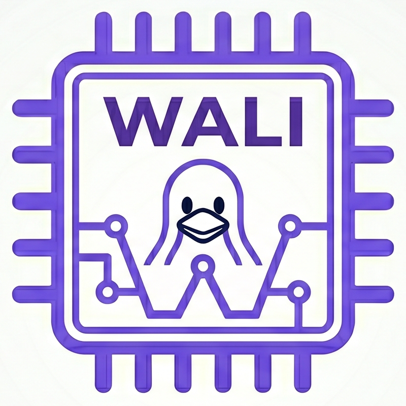

# WALI : The WebAssembly Linux Interface

 <h2> WebAssembly is not a niche ecosystem ---   it's a <b>software-defined ISA</b> and we should treat it like one!</h2> 

WALI is a specification and implementation of the **Linux syscall interface for Wasm** based on 
the publication "[Empowering WebAssembly with Thin-Kernel Interfaces](https://dl.acm.org/doi/10.1145/3689031.3717470)" (EuroSys 2025) which proposes the need for a "low-level" virtualization layer at the *very bottom of an operating system's userspace*.

## Status

The **[spec](specification/index.md)** shows the currently supported set of syscalls/methods for WALI.
This specification is under active development, and will grow based on needs.

## Goals and Motivation 

***Software Reuse***: 
Modern software is underpinned by a plethora of
intricate software that has been deployed and optimized for decades. 
With WALI, Wasm ecosystems can immediately tap into this entire software ecosystem with minimal source code changes. 
These applications can now acquire  ISA portability, sandboxing, portability, CFI, and remote-code execution protection through a Wasm port.

***Flexible and Modular Security Enforcement***:
There is no silver bullet to security. 
The average user, average cloud ecosystem, and average automotive system all require security to various degrees of enforcement.
The goal is thus: *how do we make it easy to accomodate and build these diverse abstractions?*. 
With WALI, we enable a clean **layering** approach to API design. 
As the "bottom" layer, WALI provides feature-completeness and defers security enforcement occurs through higher-level APIs (e.g. WASI) layered over it.
It is the goal of higher-level APIs to provide a safe and controlled interface to WALI, much like an OS of today.
By decoupling these requirements of feature completeness and security, we can accomodate for a wide variety of use-cases, while also allowing these higher-level APIs to be shipped as Wasm modules themselves!

***One(or Few) Interfaces to Rule Them All***:
Wasm engines are complex pieces of software, carefully weaving together high-performance JIT compilers, runtimes, garbage collectors, profiling/debugging tools, security, and more.
System interfaces are core yet non-trivial part of these engines, and maintaining many indepedent system interfaces for different domains is a huge burden of maintainability.
Engine developers can now easily implement one/few system interfaces of interest, and instead focus on the core engine requirement 
-- *run bytecode fast*. 
Major parts of the engine can also be decoupled and virtualized as Wasm modules over WALI, keeping the core complexity of the trusted engine small.

## Sources of Divergence 

Wasm possesses stricter static properties (e.g. type-safety) and dynamic properties (e.g. sandboxing) than some low-level languages like C, so *unsafe C code may produce divergence from native binaries at runtime*.
In particular, we have observed the following occurences, that are usually the result of programs bending safety rules:

***Indirect function invocation with function pointers***: Unlike C, Wasm's `call_indirect` performs a runtime type-check which will fail on function invocation with mismatched signatures.

***Variadic function types***: Functions that use variadic arguments *must* ensure argument type consistency (e.g. `syscall` arguments must all be typecast to `long`).

Additionally, there are certain WALI-inherent extra restrictions at the moment:

***Restricted Signals***: Some signals (e.g. `SIGSEGV`) are used by the engine, and apps that overwrite those signal handlers will not operate at intended.

***Certain Filesystem endpoints***: e.g. `/proc/mem` cannot be accessed through WALI.
